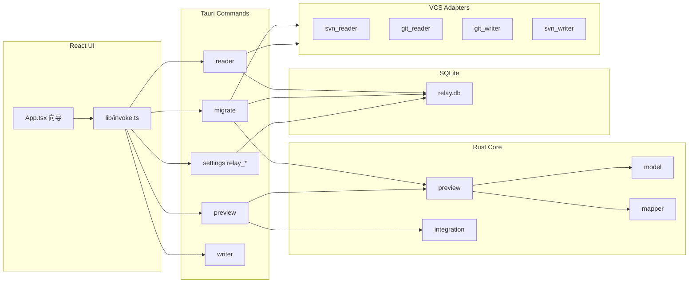

# copy-diff

跨版本控制系统（VCS）的**提交迁移**桌面工具。从源仓库（SVN / Git）挑选若干次提交，在目标仓库（Git / SVN）中复现文件变更并生成对应提交，支持全量 diff 预览、集成计划审查、冲突处理与迁移记录。

技术栈：**Tauri 2**（Rust 后端）+ **React + TypeScript**（前端）。

---

## 目录

- [它能做什么](#它能做什么)
- [典型工作流](#典型工作流)
- [当前实现状态](#当前实现状态)
- [环境要求](#环境要求)
- [快速开始](#快速开始)
- [常用命令](#常用命令)
- [项目结构](#项目结构)
- [架构说明](#架构说明)
- [前后端协作约定](#前后端协作约定)
- [开发指南](#开发指南)
- [代码规范与检查](#代码规范与检查)
- [路线图](#路线图)
- [常见问题](#常见问题)

---

## 它能做什么

| 能力 | 说明 |
|------|------|
| 仓库管理 | 保存源/目标仓库配置（路径、分支、SVN 凭据），支持 Git / SVN 探测 |
| 提交列表 | 分页拉取源仓库最近提交，人工勾选要迁移的条目 |
| 路径映射 | 源路径与目标路径不一致时配置映射，按仓库对持久化 |
| 变更预览 | 按文件聚合 diff，懒加载单文件详情，虚拟滚动渲染 |
| 集成计划 | 分析目标工作区，将每个文件标记为自动通过 / 待确认 / 阻塞 |
| 迁移执行 | 按集成策略 apply + commit，失败自动回滚工作区 |
| 冲突处理 | 用外部编辑器打开目标文件，人工处理后标记已解决 |
| 迁移记录 | SQLite 持久化每次迁移的源/目标、提交、文件与状态 |

支持的仓库组合（通过 `SourceReader` / `MigrationWriter` 适配器）：

| 源 | 目标 | 状态 |
|----|------|------|
| SVN | Git | 已支持 |
| Git | Git | 已支持 |
| SVN | SVN | 已支持 |
| Git | SVN | 已支持 |

---

## 典型工作流

向导式五步流程：

```
源仓库 → 选择提交 → 目标仓库（含路径映射）→ 变更预览 → 确认迁移
```

迁移步骤内部：

```
生成集成计划 → 审查 auto_ok / review / blocked 项
    →（阻塞项）用编辑器打开文件并标记已解决
    →（待确认项）人工确认
    → 执行迁移 → 写入迁移记录
```

核心原则：**预览与执行使用同一套映射与 ChangeSet 逻辑**；**集成计划中 review / blocked 项未处理完毕不得执行迁移**。

---

## 当前实现状态

| 模块 | 状态 |
|------|------|
| Tauri + React 脚手架、依赖、lint/test | 已完成 |
| `model` 核心数据模型（ChangeSet、FileChange…） | 已完成 |
| `store` SQLite 持久化（仓库、编辑器、迁移记录、路径映射） | 已完成 |
| `mapper` 路径映射 + 单元测试 | 已完成 |
| `SvnReader` / `GitReader`（分页列表 + load_changeset） | 已完成 |
| `GitWriter` / `SvnWriter`（prepare / apply / commit / rollback） | 已完成 |
| `preview` 预览服务、集成计划、预览缓存 | 已完成 |
| 向导 UI（源/提交/目标/预览/迁移五步） | 已完成 |
| 设置页（仓库管理、编辑器、迁移历史） | 已完成 |
| 自定义 DiffView（虚拟滚动行级 diff） | 已完成 |
| `execute_migration` 迁移执行 + 记录写入 | 已完成 |
| 实时进度事件（`unit-status` emit） | 未开始 |
| `ReplayPolicy` 批量策略（fail_stop / skip_failed） | 未接入 UI |
| 打包分发优化 | 待完善 |

---

## 环境要求

### 必需

| 工具 | 版本建议 | 用途 |
|------|----------|------|
| [Node.js](https://nodejs.org/) | 18+ | 前端构建、npm scripts |
| [Rust](https://rustup.rs/) | stable | Tauri 后端 |
| [Git](https://git-scm.com/) | 任意较新版本 | Git 仓操作 |
| [SVN](https://subversion.apache.org/) | 1.8+ | SVN 仓操作 |

### Windows 特别注意

Tauri 在 Windows 上需要 **MSVC** 工具链，不要用默认的 `gnu` 目标：

```powershell
rustup toolchain install stable-x86_64-pc-windows-msvc
rustup default stable-x86_64-pc-windows-msvc
```

仓库根目录的 [`rust-toolchain.toml`](rust-toolchain.toml) 会引导使用 MSVC。若编译报 `dlltool.exe: program not found`，说明当前仍是 GNU 工具链，请按上式切换。

还需安装 [Visual Studio Build Tools](https://visualstudio.microsoft.com/visual-cpp-build-tools/)（勾选「使用 C++ 的桌面开发」），提供 `link.exe` 等。

### 推荐 IDE 插件

见 [`.vscode/extensions.json`](.vscode/extensions.json)：

- **rust-analyzer** — Rust 语言服务
- **Tauri** — Tauri 项目支持
- **ESLint** / **Prettier** — 前端静态检查与格式化

---

## 快速开始

```bash
# 1. 克隆并进入项目
git clone <repo-url> copy-diff
cd copy-diff

# 2. 安装前端依赖
npm install

# 3. 启动桌面开发模式（同时起 Vite + Tauri）
npm run tauri dev
```

首次 `tauri dev` 会编译 Rust，耗时较长，属正常现象。

仅调试前端 UI（不启动 Tauri 窗口）：

```bash
npm run dev
# 浏览器访问 http://localhost:1420
# 注意：此时 invoke 调用会失败，只适合改样式/布局
```

---

## 常用命令

| 命令 | 说明 |
|------|------|
| `npm run tauri dev` | 桌面应用开发模式 |
| `npm run tauri build` | 打包安装包（`src-tauri/target/release/bundle/`） |
| `npm run dev` | 仅 Vite 前端 |
| `npm test` | 前端单元测试（Vitest，单次） |
| `npm run test:watch` | 前端测试监听模式 |
| `npm run test:integration` | SVN 集成测试（需本地 SVN 环境，`--ignored`） |
| `npm run lint` | ESLint 检查 `src/` |
| `npm run lint:fix` | ESLint 自动修复 |
| `npm run format` | Prettier 格式化 `src/` |
| `npm run format:check` | Prettier 检查（CI 用） |
| `cd src-tauri && cargo test` | Rust 单元测试 |
| `cd src-tauri && cargo clippy` | Rust 静态分析 |
| `cd src-tauri && cargo fmt` | Rust 格式化 |

提交前建议至少跑一遍：

```bash
npm test && npm run lint && npm run format:check
cd src-tauri && cargo test && cargo clippy
```

测试分层与 SVN 集成测试说明见 [TESTING.md](TESTING.md)。

---

## 项目结构

```
copy-diff/
├── src/                              # React 前端
│   ├── App.tsx                       # 根组件（五步向导 + 设置页）
│   ├── main.tsx                      # 入口
│   ├── styles/relay.css              # 应用样式
│   ├── lib/
│   │   ├── types.ts                  # 与 Rust store/models 对齐的 TS 类型
│   │   ├── invoke.ts                 # 封装所有 tauri::command 调用
│   │   ├── constants.ts              # 向导步骤、默认映射等
│   │   └── types.test.ts
│   ├── components/
│   │   ├── relay/                    # 向导 UI 组件
│   │   │   ├── StepRail.tsx          # 左侧步骤导航
│   │   │   ├── CommitPicker.tsx      # 提交多选列表
│   │   │   ├── FileTree.tsx          # 预览文件树
│   │   │   ├── DiffView.tsx          # 虚拟滚动 diff 视图
│   │   │   ├── ConflictWorkspace.tsx # 集成计划 / 冲突处理
│   │   │   ├── PathMappingPanel.tsx  # 路径映射配置
│   │   │   └── …
│   │   └── settings/                 # 设置页（仓库、编辑器、迁移历史）
│   └── test/setup.ts
│
├── src-tauri/                        # Rust / Tauri 后端
│   ├── src/
│   │   ├── main.rs                   # 二进制入口
│   │   ├── lib.rs                    # 注册 plugins 与 invoke_handler
│   │   ├── model.rs                  # VCS 无关核心模型（ChangeSet, FileChange…）
│   │   ├── error.rs                  # AppError
│   │   ├── mapper.rs                 # 路径映射
│   │   ├── relay.rs                  # FileChange → FileChangeView 转换
│   │   ├── diff/                     # 行级 diff 计算
│   │   ├── preview/                  # 预览服务、集成计划、缓存
│   │   ├── store/                    # SQLite 持久化
│   │   │   ├── db.rs                 # 数据库操作
│   │   │   ├── models.rs             # 前后端共享的视图模型
│   │   │   └── crypto.rs             # SVN 密码加密
│   │   ├── commands/
│   │   │   ├── settings.rs           # relay_* 仓库/编辑器/迁移记录
│   │   │   ├── reader.rs             # list_repo_commits, 路径映射
│   │   │   ├── preview.rs            # build_preview_meta, get_file_diff, 集成计划
│   │   │   ├── migrate.rs            # execute_migration
│   │   │   └── writer.rs             # open_file_in_editor
│   │   └── vcs/                      # VCS 适配器
│   │       ├── factory.rs            # SourceReader / MigrationWriter 工厂
│   │       ├── svn_reader.rs / git_reader.rs
│   │       ├── git_writer.rs / svn_writer.rs
│   │       └── svn/                  # SVN CLI 解析子模块
│   ├── capabilities/
│   ├── tauri.conf.json
│   └── Cargo.toml
│
├── eslint.config.js
├── vite.config.ts
├── rust-toolchain.toml
└── package.json
```

---

## 架构说明



### 核心概念

| 概念 | 位置 | 含义 |
|------|------|------|
| `ReplayUnitMeta` | `model.rs` | 列表里的一行提交（`svn:12345` / `git:abc1234`） |
| `ChangeSet` | `model.rs` | 一次提交带来的全部 `FileChange` |
| `FileChange` | `model.rs` | 单文件增删改及 before/after/patch |
| `FileChangeView` | `store/models.rs` | 前端展示用的文件变更（含 diff 行） |
| `MigrationMode` | `store/models.rs` | 迁移模式（见下表） |
| `IntegrationPlanResult` | `store/models.rs` | 集成计划：每个文件的审查状态与策略 |
| `VcsReader` | `vcs/mod.rs` | 源侧：列表 + 加载 ChangeSet |
| `VcsWriter` | `vcs/mod.rs` | 目标侧：prepare → apply → commit / rollback |

VCS 差异屏蔽在 **ChangeSet** 层：无论 SVN revision 还是 Git commit，进入核心逻辑后格式统一。

### 迁移模式（`MigrationMode`）

| 模式 | 行为 |
|------|------|
| `incremental_first`（默认） | 优先增量合并，目标已有内容时尽量保留 |
| `commit_result` | 以最终提交结果为准 |
| `strict_replay` | 严格按源提交顺序逐条回放 |

### 集成状态（`IntegrationStatus`）

| 状态 | 含义 |
|------|------|
| `auto_ok` | 可自动应用，无需人工干预 |
| `review` | 需人工确认后方可执行 |
| `blocked` | 目标工作区存在冲突，须用编辑器处理后标记已解决 |

---

## 前后端协作约定

### 1. 添加新的 Tauri command

1. 在 `src-tauri/src/commands/` 实现 `#[tauri::command]` 函数  
2. 在 `src-tauri/src/lib.rs` 的 `generate_handler![...]` 中注册  
3. 在 `src/lib/invoke.ts` 增加对应封装函数  
4. 若涉及新数据结构，同时更新 `store/models.rs`（或 `model.rs`）与 `src/lib/types.ts`  

### 2. 类型同步

Rust 侧用 `serde` 序列化。  
- VCS 核心模型：[`src-tauri/src/model.rs`](src-tauri/src/model.rs)  
- 前后端共享视图模型：[`src-tauri/src/store/models.rs`](src-tauri/src/store/models.rs)  
- TypeScript 镜像：[`src/lib/types.ts`](src/lib/types.ts)  

**`invoke` 传参**须用 **camelCase**（Tauri 2 约定），例如 `sourceId`，不要用 `source_id`。见 [`src/lib/invoke.ts`](src/lib/invoke.ts)。  

修改 model 后请同时改两处，并补充/更新测试。

### 3. 错误处理

Rust command 返回 `Result<T, AppError>`；`AppError` 已实现 `Serialize`，前端 `invoke` 失败时会收到结构化错误（`code` / `message` / `retryable`）。

### 4. 实时进度（计划中）

长时间任务（批量 apply）将通过 `app.emit("unit-status", payload)` 推送事件，前端用 `@tauri-apps/api/event` 的 `listen` 订阅，避免轮询。

---

## 开发指南

### 仅改前端

```bash
npm run dev
```

改 `src/` 下组件即可热更新。涉及 `invoke` 的功能必须在 `tauri dev` 下验证。

### 仅改 Rust

```bash
cd src-tauri
cargo test          # 快速验证逻辑
cargo test mapper   # 跑单个模块
```

保存后 `tauri dev` 会自动重新编译后端。

### 调试技巧

- **Rust 日志**：在 command 内使用 `log` crate  
- **前端**：Tauri 窗口内 F12 或 `tauri dev` 配置的 devtools  
- **CLI 白名单**：`git` / `svn` 在 [`tauri.conf.json`](src-tauri/tauri.conf.json) 的 shell scope 中声明  
- **数据库位置**：`%APPDATA%/com.copy-diff.app/relay.db`（Windows）

### 测试放置约定

| 语言 | 位置 | 运行方式 |
|------|------|----------|
| TypeScript | `src/**/*.test.ts` | `npm test` |
| Rust 单元测试 | 各模块 `#[cfg(test)]` | `cargo test` |
| Rust 集成测试 | `src-tauri/tests/` | `cargo test --test svn_integration -- --ignored` |

---

## 代码规范与检查

| 范围 | 格式化 | Lint |
|------|--------|------|
| `src/`（TS/TSX） | Prettier（[`.prettierrc`](.prettierrc)） | ESLint（[`eslint.config.js`](eslint.config.js)） |
| `src-tauri/src/`（Rust） | `cargo fmt`（[`rustfmt.toml`](src-tauri/rustfmt.toml)） | `cargo clippy`（[`Cargo.toml`](src-tauri/Cargo.toml) `[lints.clippy]`） |

TypeScript 开启 `strict` 模式；Rust 侧对 `unwrap` / `expect` 在 clippy 中为 `warn`，业务代码优先用 `?` 与 `AppError`。

---

## 路线图

已完成：

1. **Reader** — SVN / Git 提交列表与 ChangeSet 加载  
2. **Preview** — 映射 + 目标工作区 enrich + 集成计划  
3. **Writer** — Git / SVN prepare / apply / commit / rollback  
4. **向导 UI** — 五步流程 + 冲突工作台 + 设置页  
5. **审计** — SQLite 迁移记录  

待完善：

- 实时进度事件推送  
- `ReplayPolicy` 批量失败策略接入 UI  
- 打包分发与自动更新  
- 更完善的集成测试覆盖  

---

## 常见问题

### `cargo build` 报 `dlltool.exe: program not found`

Windows 上使用了 GNU 工具链。执行：

```powershell
rustup default stable-x86_64-pc-windows-msvc
```

并安装 Visual Studio Build Tools。

### `npm run tauri dev` 端口被占用

Vite 固定使用 **1420** 端口（见 `vite.config.ts`）。关闭占用进程或修改 `server.port` 与 `tauri.conf.json` 中的 `devUrl`。

### 前端 `invoke` 报错 `command not found`

确认已在 `lib.rs` 的 `generate_handler!` 中注册，且 `invoke` 函数名与 Rust 侧 `snake_case` 一致（如 `list_repo_commits`）。

### 仅 `npm run dev` 时功能不可用

预期行为：没有 Tauri 运行时，`invoke` 不可用。请使用 `npm run tauri dev`。

### 首次编译很慢

Tauri + 依赖 crate 较多，首次 `cargo build` 可能需数分钟，之后会增量编译。

---

## 许可证

尚未指定。贡献前请与仓库维护者确认。
