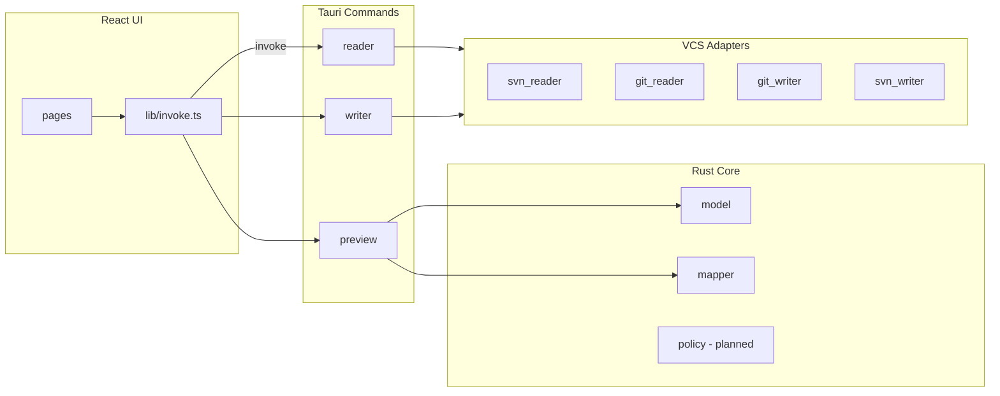

# copy-diff

跨版本控制系统（VCS）的**提交回放**桌面工具。从源仓库（SVN / Git）挑选若干次提交，在目标仓库（Git / SVN）中复现文件变更并生成对应提交，支持全量 diff 预览、失败回滚与审计记录。

技术栈：**Tauri 2**（Rust 后端）+ **React + TypeScript**（前端）。

---

## 目录

- [它能做什么](#它能做什么)
- [典型工作流](#典型工作流)
- [当前实现状态](#当前实现状态)
- [环境要求](#环境要求)
- [快速开始](#快速开始)
- [常用命令](#常用命令)
- [项目结构](#项目结构)
- [架构说明](#架构说明)
- [前后端协作约定](#前后端协作约定)
- [开发指南](#开发指南)
- [代码规范与检查](#代码规范与检查)
- [路线图](#路线图)
- [常见问题](#常见问题)

---

## 它能做什么

| 能力 | 说明 |
|------|------|
| 提交列表 | 拉取源仓库最近提交，人工勾选要回放的条目 |
| 全量预览 | 在应用前查看所有文件的 before/after diff |
| 路径映射 | 源路径与目标路径不一致时，通过配置映射 |
| 顺序回放 | 每个源提交对应目标侧一次 commit（可配置策略） |
| 失败处理 | apply 失败即回滚工作区，进入人工解决后再提交 |
| 审计 | 记录每条 source_ref 与 target_ref 的对应关系 |

计划支持的仓库组合（通过 Reader / Writer 适配器扩展）：

| 源 | 目标 | 优先级 |
|----|------|--------|
| SVN | Git | 首期 |
| Git | Git | 后续 |
| SVN | SVN | 后续 |
| Git | SVN | 后续 |

---

## 典型工作流

```
配置连接 → 拉取提交列表 → 勾选 revision → 预览 diff
    → 确认执行 →（失败）→ 冲突解决 → 校验通过 → 提交
    → 对账表记录
```

核心原则：**预览与执行使用同一套映射与 ChangeSet 逻辑**；**校验未通过不得 commit**，避免目标仓库出现不可用代码。

---

## 当前实现状态

> 项目处于早期脚手架阶段，以下为截至 step 1 的状态。

| 模块 | 状态 |
|------|------|
| Tauri + React 脚手架、依赖、lint/test | 已完成 |
| `model` 数据模型（Rust + TS 类型镜像） | 已完成 |
| `mapper` 路径映射 + 单元测试 | 已完成 |
| `VcsReader` / `VcsWriter` trait 与桩实现 | 桩代码，待实现 |
| Tauri commands（`list_commits`、`build_preview` 等） | 桩代码，返回空数据 |
| 前端页面（Setup / CommitList / Preview 等） | 目录已预留，仅 `App.tsx` 桥接测试 |
| SQLite 审计、Monaco diff UI | 未开始 |

本地验证桥接是否正常：运行 `npm run tauri dev`，界面应显示 **Rust bridge: connected**（调用 `ping` command）。

---

## 环境要求

### 必需

| 工具 | 版本建议 | 用途 |
|------|----------|------|
| [Node.js](https://nodejs.org/) | 18+ | 前端构建、npm scripts |
| [Rust](https://rustup.rs/) | stable | Tauri 后端 |
| [Git](https://git-scm.com/) | 任意较新版本 | 目标仓操作、开发 |
| [SVN](https://subversion.apache.org/) | 1.8+ | 源仓操作（首期） |

### Windows 特别注意

Tauri 在 Windows 上需要 **MSVC** 工具链，不要用默认的 `gnu` 目标：

```powershell
rustup toolchain install stable-x86_64-pc-windows-msvc
rustup default stable-x86_64-pc-windows-msvc
```

仓库根目录的 [`rust-toolchain.toml`](rust-toolchain.toml) 会引导使用 MSVC。若编译报 `dlltool.exe: program not found`，说明当前仍是 GNU 工具链，请按上式切换。

还需安装 [Visual Studio Build Tools](https://visualstudio.microsoft.com/visual-cpp-build-tools/)（勾选「使用 C++ 的桌面开发」），提供 `link.exe` 等。

### 推荐 IDE 插件

见 [`.vscode/extensions.json`](.vscode/extensions.json)：

- **rust-analyzer** — Rust 语言服务
- **Tauri** — Tauri 项目支持
- **ESLint** / **Prettier** — 前端静态检查与格式化

---

## 快速开始

```bash
# 1. 克隆并进入项目
git clone <repo-url> copy-diff
cd copy-diff

# 2. 安装前端依赖
npm install

# 3. 启动桌面开发模式（同时起 Vite + Tauri）
npm run tauri dev
```

首次 `tauri dev` 会编译 Rust，耗时较长，属正常现象。

仅调试前端 UI（不启动 Tauri 窗口）：

```bash
npm run dev
# 浏览器访问 http://localhost:1420
# 注意：此时 invoke 调用会失败，只适合改样式/布局
```

---

## 常用命令

| 命令 | 说明 |
|------|------|
| `npm run tauri dev` | 桌面应用开发模式 |
| `npm run tauri build` | 打包安装包（`src-tauri/target/release/bundle/`） |
| `npm run dev` | 仅 Vite 前端 |
| `npm test` | 前端单元测试（Vitest，单次） |
| `npm run test:watch` | 前端测试监听模式 |
| `npm run lint` | ESLint 检查 `src/` |
| `npm run lint:fix` | ESLint 自动修复 |
| `npm run format` | Prettier 格式化 `src/` |
| `npm run format:check` | Prettier 检查（CI 用） |
| `cd src-tauri && cargo test` | Rust 单元测试 |
| `cd src-tauri && cargo clippy` | Rust 静态分析 |
| `cd src-tauri && cargo fmt` | Rust 格式化 |

提交前建议至少跑一遍：

```bash
npm test && npm run lint && npm run format:check
cd src-tauri && cargo test && cargo clippy
```

---

## 项目结构

```
copy-diff/
├── src/                          # React 前端
│   ├── App.tsx                   # 根组件（当前：ping 桥接测试）
│   ├── main.tsx                  # 入口
│   ├── App.css                   # Tailwind 入口（@import "tailwindcss"）
│   ├── lib/
│   │   ├── types.ts              # 与 Rust model 对齐的 TS 类型（须保持同步）
│   │   ├── invoke.ts             # 封装所有 tauri::command 调用
│   │   └── types.test.ts
│   ├── pages/                    # 页面（待实现：Setup, CommitList, Preview…）
│   ├── components/               # 可复用组件（待实现：DiffViewer, FileTree…）
│   ├── store/                    # Zustand 状态（待实现）
│   └── test/setup.ts             # Vitest 全局 setup
│
├── src-tauri/                    # Rust / Tauri 后端
│   ├── src/
│   │   ├── main.rs               # 二进制入口，调用 lib::run()
│   │   ├── lib.rs                # 注册 plugins 与 invoke_handler
│   │   ├── model.rs              # 核心数据结构（ChangeSet, ReplayPlan…）
│   │   ├── error.rs              # AppError + Tauri 可序列化错误
│   │   ├── mapper.rs             # 路径映射
│   │   ├── commands/             # #[tauri::command] 入口
│   │   │   ├── reader.rs         # list_commits
│   │   │   ├── preview.rs        # build_preview
│   │   │   └── writer.rs         # apply_unit, commit_resolved, …
│   │   └── vcs/                  # VCS 适配器
│   │       ├── mod.rs            # VcsReader / VcsWriter trait
│   │       ├── svn_reader.rs
│   │       ├── git_reader.rs
│   │       ├── git_writer.rs
│   │       └── svn_writer.rs
│   ├── capabilities/             # Tauri 2 权限配置
│   ├── tauri.conf.json           # 窗口、构建、shell 白名单（git/svn）
│   ├── Cargo.toml
│   ├── rustfmt.toml
│   └── .clippy.toml
│
├── eslint.config.js              # ESLint flat config
├── .prettierrc
├── vite.config.ts                # Vite + Vitest + Tailwind
├── rust-toolchain.toml           # 固定 Rust MSVC 工具链
└── package.json
```

---

## 架构说明



### 核心概念

| 概念 | 位置 | 含义 |
|------|------|------|
| `ReplayUnitMeta` | `model.rs` | 列表里的一行提交（rev / sha、作者、说明） |
| `ChangeSet` | `model.rs` | 一次提交带来的全部 `FileChange` |
| `FileChange` | `model.rs` | 单文件增删改及 before/after/patch |
| `ReplayPlan` | `model.rs` | 有序 ChangeSet 列表 + 回放策略 |
| `PreviewResult` | `model.rs` | 预览聚合结果 + 冲突风险统计 |
| `VcsReader` | `vcs/mod.rs` | 源侧：列表 + 加载 ChangeSet |
| `VcsWriter` | `vcs/mod.rs` | 目标侧：prepare → apply → validate → commit / rollback |

VCS 差异屏蔽在 **ChangeSet** 层：无论 SVN revision 还是 Git commit，进入核心逻辑后格式统一。

### 回放策略（`ReplayPolicy`）

| 策略 | 行为 |
|------|------|
| `fail_stop`（默认） | 任一 unit 失败则暂停整批 |
| `skip_failed` | 跳过失败项，继续后续（审计须记录缺口） |
| `manual_on_fail` | 失败后进入人工解决流程再继续 |

---

## 前后端协作约定

### 1. 添加新的 Tauri command

1. 在 `src-tauri/src/commands/` 实现 `#[tauri::command]` 函数  
2. 在 `src-tauri/src/lib.rs` 的 `generate_handler![...]` 中注册  
3. 在 `src/lib/invoke.ts` 增加对应封装函数  
4. 若涉及新数据结构，同时更新 `model.rs` 与 `src/lib/types.ts`  

### 2. 类型同步

Rust 侧用 `serde` 序列化，字段名默认 **snake_case**（如 `source_ref`）。  
TypeScript 侧 [`src/lib/types.ts`](src/lib/types.ts) 须与 [`src-tauri/src/model.rs`](src-tauri/src/model.rs) 保持一致。  
修改 model 后请同时改两处，并补充/更新测试。

### 3. 错误处理

Rust command 返回 `Result<T, AppError>`；`AppError` 已实现 `Serialize`，前端 `invoke` 失败时会收到字符串错误信息。

### 4. 实时进度（计划中）

长时间任务（批量 apply）将通过 `app.emit("unit-status", payload)` 推送 [`UnitStatusEvent`](src/lib/types.ts)，前端用 `@tauri-apps/api/event` 的 `listen` 订阅，避免轮询。

---

## 开发指南

### 仅改前端

```bash
npm run dev
```

改 `src/` 下组件即可热更新。涉及 `invoke` 的功能必须在 `tauri dev` 下验证。

### 仅改 Rust

```bash
cd src-tauri
cargo test          # 快速验证逻辑
cargo test mapper   # 跑单个模块
```

保存后 `tauri dev` 会自动重新编译后端。

### 调试技巧

- **Rust 日志**：在 command 内使用 `log` crate（需在 `Cargo.toml` 启用 `tauri` 的 `devtools` 等，按需配置）  
- **前端**：浏览器 DevTools（Tauri 窗口内 F12 或 `tauri dev` 配置的 devtools）  
- **CLI 白名单**：`git` / `svn` 在 [`tauri.conf.json`](src-tauri/tauri.conf.json) 的 `plugins.shell.scope` 中声明  

### 测试放置约定

| 语言 | 位置 | 运行方式 |
|------|------|----------|
| TypeScript | `src/**/*.test.ts` 或同目录 `*.test.ts` | `npm test` |
| Rust | 各模块 `#[cfg(test)] mod tests` | `cargo test` |

新增 `mapper`、纯解析逻辑等优先写 Rust 单元测试；UI 交互用 Vitest + Testing Library（待补充）。

---

## 代码规范与检查

| 范围 | 格式化 | Lint |
|------|--------|------|
| `src/`（TS/TSX） | Prettier（[`.prettierrc`](.prettierrc)） | ESLint（[`eslint.config.js`](eslint.config.js)） |
| `src-tauri/src/`（Rust） | `cargo fmt`（[`rustfmt.toml`](src-tauri/rustfmt.toml)） | `cargo clippy`（[`Cargo.toml`](src-tauri/Cargo.toml) `[lints.clippy]`） |

TypeScript 开启 `strict` 模式；Rust 侧对 `unwrap` / `expect` 在 clippy 中为 `warn`，业务代码优先用 `?` 与 `AppError`。

---

## 路线图

按实现顺序：

1. **SVN Reader** — `svn log` / `svn diff` 解析，CommitList 页  
2. **Preview** — 映射 + before/after + `git apply --check`，Preview 页 + Monaco diff  
3. **Git Writer** — prepare / apply / commit / rollback，Execute 页  
4. **冲突工作台** — 失败回滚、IDE 打开、校验闸门、Resolve 页  
5. **审计** — SQLite `replay_log`，Audit 页  
6. **配置与打包** — `config.yaml` 持久化、`tauri build`  

扩展：Git Reader、SVN Writer、其余仓库组合。

---

## 常见问题

### `cargo build` 报 `dlltool.exe: program not found`

Windows 上使用了 GNU 工具链。执行：

```powershell
rustup default stable-x86_64-pc-windows-msvc
```

并安装 Visual Studio Build Tools。

### `npm run tauri dev` 端口被占用

Vite 固定使用 **1420** 端口（见 `vite.config.ts`）。关闭占用进程或修改 `server.port` 与 `tauri.conf.json` 中的 `devUrl`。

### 前端 `invoke` 报错 `command not found`

确认已在 `lib.rs` 的 `generate_handler!` 中注册，且 `invoke` 函数名与 Rust 侧 `snake_case` 一致（如 `list_commits`）。

### 仅 `npm run dev` 时 bridge 显示 error

预期行为：没有 Tauri 运行时，`invoke` 不可用。请使用 `npm run tauri dev`。

### 首次编译很慢

Tauri + 依赖 crate 较多，首次 `cargo build` 可能需数分钟，之后会增量编译。

---

## 许可证

尚未指定。贡献前请与仓库维护者确认。
