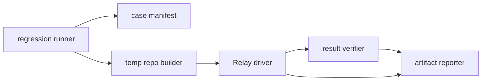

# Relay 自动回归方案

本文说明如何把 [`TESTING.md`](../TESTING.md) 中“验收测试”章节定义的黑盒测试集自动化，并在失败时自动记录足够的诊断信息。

## 设计原则

- **黑盒判定**：用 Git/SVN 命令和目标文件系统状态判断结果，不直接断言内部函数。
- **临时仓库**：每次运行创建全新的源/目标仓库，避免污染开发环境。
- **可复现**：失败用例保留仓库快照、日志、manifest、命令输出和截图。
- **先保核心风险**：优先自动化代码迁移结果校验，再补 UI 交互覆盖。
- **结果不模糊**：每个用例必须产出 `passed / failed / skipped` 和结构化错误原因。

## 总体架构



建议目录：

```text
scripts/regression/
  run-regression.ps1
  cases/
    smoke.json
    release.json
    production-safety.json
  lib/
    repo-fixtures.ps1
    relay-driver.ps1
    verify-git.ps1
    verify-svn.ps1
    report.ps1
artifacts/regression/
  <run_id>/
    summary.json
    summary.md
    cases/
      <case_id>/
        case.json
        result.json
        error.json
        commands.log
        app.log
        stdout.log
        stderr.log
        before/
        after/
```

## 执行层级

### L1：迁移核心回归

目标：验证不会漏文件、多文件、误写路径、错误提交或失败不回滚。

执行方式：

1. 脚本创建临时 Git/SVN 源仓库和目标仓库。
2. 按测试集构造源提交序列和目标 baseline。
3. 通过 Relay 自动化入口完成仓库注册、预览、集成计划、迁移执行。
4. 用 Git/SVN CLI 和文件哈希验证结果。
5. 失败时保留完整临时仓库。

这是发布前必须稳定运行的主回归。

### L2：UI 冒烟回归

目标：验证桌面界面的关键流程仍可操作。

覆盖最少即可：

- 添加 Git 仓库。
- 拉取提交列表。
- 选择 1 个提交。
- 选择目标仓库。
- 查看预览。
- 进入迁移页并生成集成计划。

UI 冒烟不负责覆盖所有迁移组合，避免测试过慢和脆弱。

## 自动化入口选择

推荐分两步落地：

| 阶段 | 入口 | 说明 |
|---|---|---|
| 第 1 阶段 | 测试专用 CLI/runner 调用应用公开命令语义 | 最快覆盖迁移正确性，适合 CI |
| 第 2 阶段 | Tauri/WebDriver 或 Playwright 驱动 UI | 覆盖用户真实操作链路 |

第 1 阶段可以提供一个仅测试使用的 runner，但它的验收仍必须以外部结果为准：目标仓库 diff、文件哈希、提交记录、迁移记录。不要把“函数返回成功”作为通过标准。

## 用例定义格式

每个用例用 JSON 描述，runner 只读取 manifest，不在脚本中硬编码预期。

```json
{
  "id": "F05-GG",
  "sourceType": "git",
  "targetType": "git",
  "sourceCommits": ["C01-add-text", "C02-modify-text", "C03-delete-text"],
  "pathMappings": [{ "from": ".", "to": "." }],
  "migrationMode": "incremental_first",
  "squash": false,
  "expected": {
    "changedFiles": {
      "src/new_file.txt": "sha256:<hash>",
      "src/existing.txt": "sha256:<hash>"
    },
    "deletedFiles": ["src/delete_me.txt"],
    "absentFiles": ["tmp/transient.txt"],
    "unchangedFiles": ["README.md", "src/target_only.txt"],
    "commitCount": 3,
    "worktreeClean": true
  }
}
```

对需要失败的用例使用：

```json
{
  "id": "I03-GG",
  "sourceType": "git",
  "targetType": "git",
  "sourceCommits": ["C01-add-text"],
  "pathMappings": [{ "from": "unmatched", "to": "." }],
  "expectFailure": {
    "phase": "preview",
    "messageContains": "mapping",
    "targetMustRemainAtBaseline": true
  }
}
```

## Runner 流程

每个用例按固定步骤执行：

1. **准备目录**
   - 创建 `artifacts/regression/<run_id>/cases/<case_id>/`。
   - 写入 `case.json`。

2. **创建源仓库**
   - Git：`git init`，写入 baseline，逐个 commit。
   - SVN：`svnadmin create`，`svn checkout file:///...`，逐个 `svn commit`。
   - 保存提交别名到 `refs.json`，例如 `C02-modify-text -> git:<sha>` 或 `svn:<rev>`。

3. **创建目标仓库**
   - 写入目标 baseline。
   - 记录 `target_baseline_ref.txt`。
   - 生成 `before/manifest.json`，包含文件列表和 SHA256。

4. **执行 Relay**
   - 注册源/目标仓库。
   - 保存路径映射。
   - 选择提交。
   - 生成预览和集成计划。
   - 按用例配置接受 review 或模拟 blocked 已解决。
   - 执行迁移。

5. **验证结果**
   - 工作区是否干净。
   - 目标变更文件集合是否等于预期。
   - 目标文件哈希是否等于预期。
   - 删除文件是否确实不存在。
   - 不相关文件哈希是否不变。
   - 提交数量是否正确。
   - 失败用例是否没有改变目标 baseline。

6. **写入结果**
   - 成功写 `result.json`。
   - 失败写 `error.json`，复制所有诊断材料。
   - 更新 `summary.json` 和 `summary.md`。

## 校验规则

### 文件集合校验

Git 目标：

```powershell
git -C $target diff --name-status $baseline HEAD
```

SVN 目标：

```powershell
svn diff --summarize $target
svn status $target
```

校验时区分：

- `changedFiles`：必须存在且哈希匹配。
- `deletedFiles`：必须不存在。
- `absentFiles`：不能出现在目标。
- `unchangedFiles`：哈希必须等于 baseline。
- `forbiddenFiles`：任何情况下不能出现，例如错误映射目录。

### 内容校验

所有文本和二进制都用 SHA256 做最终判定。文本 diff 只作为错误报告辅助信息，不作为唯一判断标准。

```powershell
Get-FileHash $file -Algorithm SHA256
```

### 工作区校验

Git：

```powershell
git -C $target status --porcelain
```

SVN：

```powershell
svn status $target
```

通过标准：命令输出为空，或只包含用例明确允许的忽略项。

### 回滚校验

失败用例必须比较 `before/manifest.json` 和 `after/manifest.json`：

- 文件列表完全一致。
- 所有文件哈希完全一致。
- Git `HEAD` 等于 baseline；SVN revision 或 working copy 内容回到 baseline。

## 错误记录格式

每个失败用例写 `error.json`：

```json
{
  "caseId": "I04-GG",
  "phase": "verify",
  "errorType": "content_mismatch",
  "message": "src/chain.txt hash mismatch",
  "expected": {
    "path": "src/chain.txt",
    "sha256": "expected..."
  },
  "actual": {
    "path": "src/chain.txt",
    "sha256": "actual..."
  },
  "commands": [
    {
      "cmd": "git -C <target> diff --name-status <baseline> HEAD",
      "exitCode": 0,
      "stdoutPath": "stdout.log",
      "stderrPath": "stderr.log"
    }
  ],
  "artifacts": {
    "caseDir": "artifacts/regression/<run_id>/cases/I04-GG",
    "targetBeforeManifest": "before/manifest.json",
    "targetAfterManifest": "after/manifest.json",
    "targetDiff": "after/target.diff",
    "appLog": "app.log"
  }
}
```

`phase` 固定为：

| phase | 含义 |
|---|---|
| `setup` | 临时仓库创建失败 |
| `probe` | 仓库识别或注册失败 |
| `preview` | 预览生成失败或预览结果不符合预期 |
| `plan` | 集成计划错误 |
| `execute` | 迁移执行失败 |
| `verify` | 执行成功但目标结果错误 |
| `cleanup` | 清理失败，不影响用例结论但需记录 |

`errorType` 建议固定为：

- `missing_file`
- `unexpected_file`
- `content_mismatch`
- `dirty_worktree`
- `commit_count_mismatch`
- `wrong_failure_phase`
- `unexpected_success`
- `unexpected_failure`
- `rollback_failed`
- `migration_record_mismatch`

## 自动采集材料

失败时必须保留：

| 文件 | 内容 |
|---|---|
| `case.json` | 用例输入 |
| `refs.json` | 源提交别名到实际 ref 的映射 |
| `before/manifest.json` | 执行前目标文件哈希 |
| `after/manifest.json` | 执行后目标文件哈希 |
| `after/target.diff` | 目标仓库实际 diff |
| `commands.log` | 所有外部命令、退出码、耗时 |
| `stdout.log` / `stderr.log` | 失败阶段相关命令输出 |
| `app.log` | Relay 运行日志 |
| `db-export.json` | 迁移记录导出，若可用 |
| `screenshot.png` | UI 冒烟失败时的截图 |

通过用例可以只保留 `case.json`、`result.json` 和必要摘要；失败用例必须完整保留。

## 命令设计

当前已落地 Git -> Git 第一阶段 runner，可执行：

```powershell
npm run test:regression:smoke
npm run test:regression:safety
npm run test:regression:release
npm run test:regression:ui
npm run test:regression:all
```

产物写入：

```text
artifacts/regression/<run_id>/
```

失败用例查看：

```text
artifacts/regression/<run_id>/cases/<case_id>/error.json
artifacts/regression/<run_id>/cases/<case_id>/after/target.diff
artifacts/regression/<run_id>/cases/<case_id>/before/manifest.json
artifacts/regression/<run_id>/cases/<case_id>/after/manifest.json
```

设计目标中的完整 npm scripts 如下：

```json
{
  "test:regression:smoke": "powershell -ExecutionPolicy Bypass -File scripts/regression/run-regression.ps1 -Suite smoke",
  "test:regression:safety": "powershell -ExecutionPolicy Bypass -File scripts/regression/run-regression.ps1 -Suite production-safety",
  "test:regression:release": "powershell -ExecutionPolicy Bypass -File scripts/regression/run-regression.ps1 -Suite release",
  "test:regression:ui": "powershell -ExecutionPolicy Bypass -File scripts/regression/run-regression.ps1 -Suite ui-smoke",
  "test:regression:all": "npm run test:regression:release && npm run test:regression:ui"
}
```

脚本参数：

```powershell
scripts/regression/run-regression.ps1 `
  -Suite production-safety `
  -KeepPassed:$false `
  -KeepFailed:$true `
  -OutDir artifacts/regression
```

## 套件分层

| 套件 | 用途 | 覆盖 |
|---|---|---|
| `smoke` | 每次提交前快速运行 | Git -> Git 的 I01、I03、I04 |
| `production-safety` | 修改迁移核心前必跑 | Git -> Git 的 I01-I08、文件复杂度、路径映射、迁移模式、squash、回滚、历史记录 smoke |
| `release` | 完整回归 | `production-safety` + 本地 SVN 的 SVN -> Git、Git -> SVN、SVN -> SVN 核心矩阵 |
| `ui-smoke` | UI 冒烟 | 当前记录为可跳过门禁；接入 tauri-driver/WebDriver 后覆盖添加仓库、选择提交、预览、生成计划 |

SVN 用例使用本地 `svnadmin create` 和 `svn checkout file://...`，不访问网络。本机缺少 `svn` 或 `svnadmin` 时对应 case 会写入 skipped 原因；正式 release 环境应安装 SVN 工具并要求 SVN case 零 skipped。

## CI 规则

推荐规则：

| 分支/动作 | 必跑 |
|---|---|
| 普通 PR | 单元测试 + `test:regression:smoke` |
| 修改迁移/预览/VCS/mapper | `test:regression:safety` |
| release 分支 | `test:regression:release` |

CI 失败时上传 `artifacts/regression/<run_id>`。

## 首批落地顺序

1. 实现 Git -> Git 临时仓库构造。
2. 自动化 `I01-I08`。
3. 增加 `summary.json`、`summary.md`、`error.json`。
4. 接入 `npm run test:regression:safety`。
5. 增加本地 SVN 数据集。
6. 增加 UI 冒烟。

不要先追求全量 UI 自动化。这个项目的核心生产风险是迁移结果错误，优先让文件集合、内容哈希、提交数量和回滚校验稳定跑起来。
